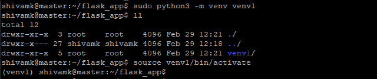

#Task 1: Docker, Docker Hub

##Task Overview

- Create a Dockerfile for a simple web application (e.g. a Node.js or 
Python app)
- Build the image using the Dockerfile and run the container
- Verify that the application is working as expected by accessing it in a web browser
- Push the image to a public or private repository (e.g. Docker Hub)
- Pull image and run it again
---

Refrence URL


>https://tecadmin.net/how-to-create-and-run-a-flask-application-using-docker/


- Setup Python environment  with Flask framework

1. Install python and pip if not already installed on your system (Here Ubuntu 22.04). 
```bash
sudo apt install python3
sudo apt install python3-pip
sudo apt install python3-venv
```


Create project directory and go into it.

```bash
sudo mkdir flask_app 
cd flask_app/
```

2. Now create virtual environment inside this folder and  activate it.

```bash
sudo python3 -m venv venv1
source venv1/bin/activate 
```



3. Install flask  using pip and freeze the requirements for project.

```bash
pip install Flask 
pip freeze > requirements.txt
```


4. Create an app.py file which will be our main application file:

```bash 
vim app.py
```

```python
from flask import Flask

app = Flask(__name__)

@app.route('/')
def index():
    return 'Hello'

@app.route('/welcome')
def welcome():
    return 'Welcome'

if __name__ == '__main__':
    app.run(debug=True)
```

Contents of flask app directory will look like this.

```bash
cat app.py
```


Run the flask application to test before creating docker image.

```bash
flask run --host 0.0.0.0 --port 5000
```


Go to web browser and check for http://yourvmip:5000/. You should see "Hello" on the page.


---
Create Dockerfile in the same directory i.e., flask app directory.

```bash
sudo vi Dockerfile
```

```Dockerfile
FROM python:3-alpine

# Create app directory
WORKDIR /app

# Install app dependencies
COPY requirements.txt ./

RUN pip install -r requirements.txt

# Bundle app source
COPY . .

EXPOSE 5000
CMD [ "flask", "run","--host","0.0.0.0","--port","5000"]
```

```bash
cat Dockerfile
```


---


 Now , we will build and run our docker image using the following commands :

```bash
 docker build -t flask-app .
```

 

To show docker images just created run below command:

 ```bash
 sudo docker images
```


To run the container from local image just created from above dockerfile run this command.

```bash
docker run -d -p 5000:5000 --name my_flask_app flask-app
```


To push a local Docker image to a Docker Hub repository, you need to follow these general steps:

1. Tag the local Docker image: Before pushing the image, you need to tag it with the repository name. The format for tagging is docker tag local_image:tag repository_name:tag.
   
```bash
docker tag flask-app:latest shivamk23/task1_flask_app:first
```


2. Login to Docker Hub: Use the docker login command to authenticate with your Docker Hub account.
Instead your password you can use  an access token which is more secure. You can generate it in Docker Hub under settings.
docker login

Username: shivamk23
Password:


3. Push the image to Docker Hub: Once logged in, use the docker push command to upload the tagged image to your Docker Hub repository.

```bash
docker push shivamk23/task1_flask_app:first
```


4. Delete all the  previous images of the app by running this command in terminal:

```bash
docker rmi -f <image-id>
```


5. Now you have two options to run container either pull the image first and then run or use the run command without pulling it.

```bash
docker pull shivamk23/task1_flask_app:first
```


```bash
docker run -d -p 5000:5000 --name flask_containerSSK shivamk23/task1_flask_repo:latest
```


Check in browser with  `http://<your_ip>:5000/`


---

