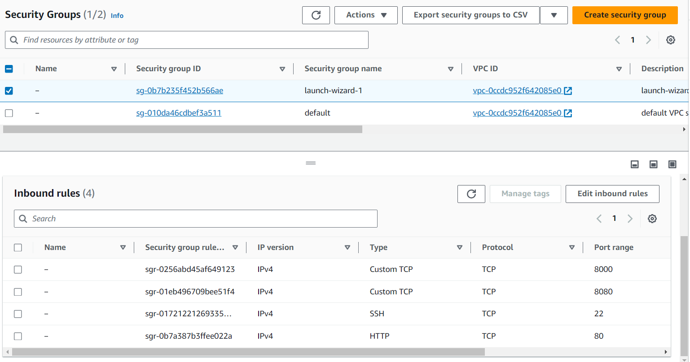
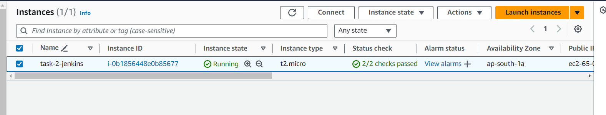

##Task 2: AWS, Jenkins, Docker, CICD, NodeJS

###Task Overview


1. Setting up AWS Infrastructure:
2. Installing and Configuring Jenkins:
3. Setting up Docker:
4. Creating Node.js Application:
5. Implementing CICD Pipeline:


###Prerequisites

**Minimum hardware requirements:**

- 256 MB of RAM
- 1 GB of drive space (although 10 GB is a recommended minimum if running Jenkins as a Docker container)

**Recommended hardware configuration for a small team:**

- 4 GB+ of RAM
- 50 GB+ of drive space
- Comprehensive hardware recommendations:
- Hardware: see the Hardware Recommendations page

**Software requirements:**

- Java - Openjdk version "17.0.9" 2023-10-17
- Docker - Docker version 24.0.5
- Jenkins - v2.440.1
- NodeJS - v12.22.9
- npm - v8.5.1
- Linux operating system - AWS Ubuntu server 22.04
  


### 1.Setting up AWS Infrastructure:

Reference URL
>https://www.jenkins.io/doc/book/installing/linux/


- Create a key pair using Amazon EC2. If you already have one, you can skip to step 3.


- Create a security group for your Amazon EC2 instance and add inbound rules as below. If you already have one, you can skip to step 4.



- Launch an Amazon EC2 instance.



###2. Installing and Configuring Jenkins:

  Referance URL
  >https://www.jenkins.io/doc/tutorials/tutorial-for-installing-jenkins-on-AWS/


To install jenkins run below  command in terminal :
```bash
sudo wget -O /usr/share/keyrings/jenkins-keyring.asc \
  https://pkg.jenkins.io/debian-stable/jenkins.io-2023.key
echo deb [signed-by=/usr/share/keyrings/jenkins-keyring.asc] \
  https://pkg.jenkins.io/debian-stable binary/ | sudo tee \
  /etc/apt/sources.list.d/jenkins.list > /dev/null
sudo apt-get update  
sudo apt-get install jenkins
```
- Jenkins requires Java to run, yet not all Linux distributions include Java by default. Additionally, not all Java versions are compatible with Jenkins.
- Install JDK 17 on ubuntu  by running the following commands in the terminal:

```bash
sudo apt update
sudo apt install fontconfig openjdk-17-jre
java -version
openjdk version "17.0.8" 2023-07-18
OpenJDK Runtime Environment (build 17.0.8+7-Debian-1deb12u1)
OpenJDK 64-Bit Server VM (build 17.0.8+7-Debian-1deb12u1, mixed mode, sharing)
```
After running above command it will show your jenkins admin password .Copy that password for further use.

Open http://your_EC2_IP_address:8080 on the browser , You should see the Jenkins welcome page.

Now we need to setup docker plugin by following these steps :

- Go to Manage Jenkins -> Manage Plugins -> Available tab -> Docker Integr    ation ->Install without restart.
- Go to Manage Jenkins -> Manage Plugins -> Available tab -> Search Docker -> Click on Get It button -> Restart Jenkins Server    
  


- Clean up tutorial resources.


###3. Setting up Docker:
###4. Creating Node.js Application:
###5. Implementing CICD Pipeline: