##Task 2: AWS, Jenkins, Docker, CICD, NodeJS

###Task Overview


1. Setting up AWS Infrastructure:
2. Installing and Configuring Jenkins:
3. Setting up Docker:
4. Creating Node.js Application:
5. Implementing CICD Pipeline:


###Prerequisites

**Minimum hardware requirements:**

- 256 MB of RAM
- 1 GB of drive space (although 10 GB is a recommended minimum if running Jenkins as a Docker container)

**Recommended hardware configuration for a small team:**

- 4 GB+ of RAM
- 50 GB+ of drive space
- Comprehensive hardware recommendations:
- Hardware: see the Hardware Recommendations page

**Software requirements:**

- Java - Openjdk version "17.0.9" 2023-10-17
- Docker - Docker version 24.0.5
- Jenkins - v2.440.1
- NodeJS - v12.22.9
- npm - v8.5.1
- Linux operating system - AWS Ubuntu server 22.04
  


### 1.Setting up AWS Infrastructure:

Reference URL
>https://www.jenkins.io/doc/book/installing/linux/


- Create a key pair using Amazon EC2. If you already have one, you can skip to step 3.


- Create a security group for your Amazon EC2 instance and add inbound rules as below. If you already have one, you can skip to step 4.


- Launch an Amazon EC2 instance.


- Clic k on `Connect` button and it take you tu page  with different options to connect to your instance.

Choose whatever you like.

---

###2. Installing and Configuring Jenkins:

  Referance URL
  >https://www.jenkins.io/doc/tutorials/tutorial-for-installing-jenkins-on-AWS/


- To install jenkins run below  command in terminal of your ec2 instance:
```bash
sudo wget -O /usr/share/keyrings/jenkins-keyring.asc \
  https://pkg.jenkins.io/debian-stable/jenkins.io-2023.key
echo deb [signed-by=/usr/share/keyrings/jenkins-keyring.asc] \
  https://pkg.jenkins.io/debian-stable binary/ | sudo tee \
  /etc/apt/sources.list.d/jenkins.list > /dev/null
sudo apt-get update  
sudo apt-get install jenkins
```
- Jenkins requires Java to run, yet not all Linux distributions include Java by default. Additionally, not all Java versions are compatible with Jenkins.
- Install JDK 17 on ubuntu  by running the following commands in the terminal:

```bash
sudo apt update
sudo apt install fontconfig openjdk-17-jre
java -version
openjdk version "17.0.8" 2023-07-18
OpenJDK Runtime Environment (build 17.0.8+7-Debian-1deb12u1)
OpenJDK 64-Bit Server VM (build 17.0.8+7-Debian-1deb12u1, mixed mode, sharing)
```

- Now start, stop  or restart your server as needed. 
```bash
sudo systemctl status jenkins
sudo systemctl stop jenkins
sudo systemctl start jenkins
```

- After running above command it will show your jenkins admin password .Copy that password for further use.

Open http://your_EC2_IP_address:8080 on the browser , You should see the Jenkins welcome page.


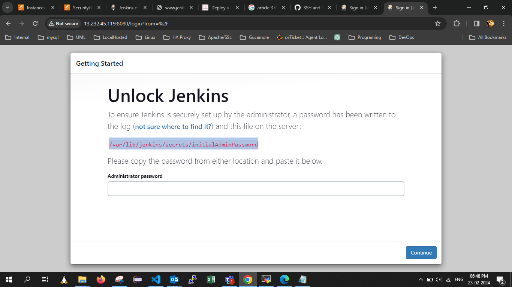

- After running above command it will show your jenkins admin password .Copy that password for further use.


- Jenkins will ask you to setup admin user. Choose as you want.

- After that Jenkins will ask you to choose between “Install suggested plugins” or Choose Plugins to be installed.  
Or we can install pluggins later.

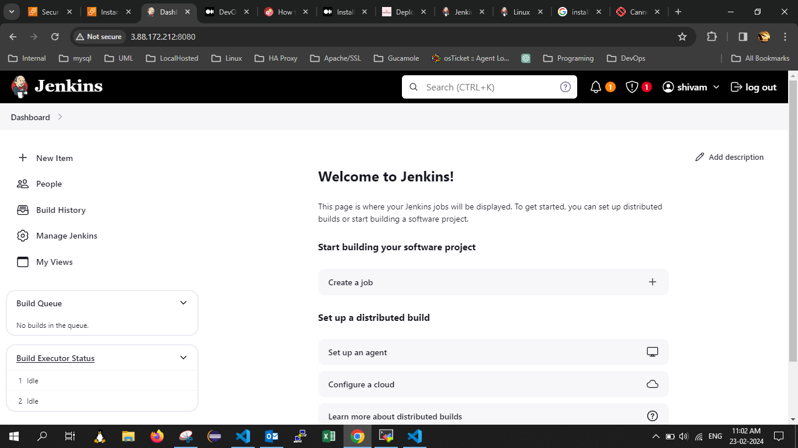

- Go to Manage Jenkins -> Manage Plugins -> Available tab -> Docker Integr    ation ->Install without restart.
- Go to Manage Jenkins -> Manage Plugins -> Available tab -> Search Docker -> Click on Get It button -> Restart Jenkins Server.

- Following pluggins will be required.
  Docker related 
  GitHub related
  Pipeline related


- Now create credentials in Jenkins which allows jenkins running on EC2 to access github.

- Go to your ec2 terminal.

- Generate ssk key using  ssh-keygen :

`ssh-keygen`
- This will generate id_rsa and id_rsa.pub in /home/ec2-user/.ssh directory.
  
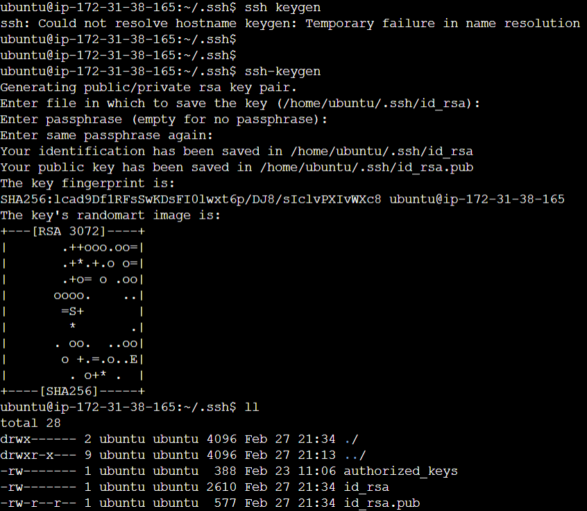

- Add content of id_rsa.pub to Jenkins.

Goto Manage Jenkins -> Manage Credentials -> System -> Global Scope

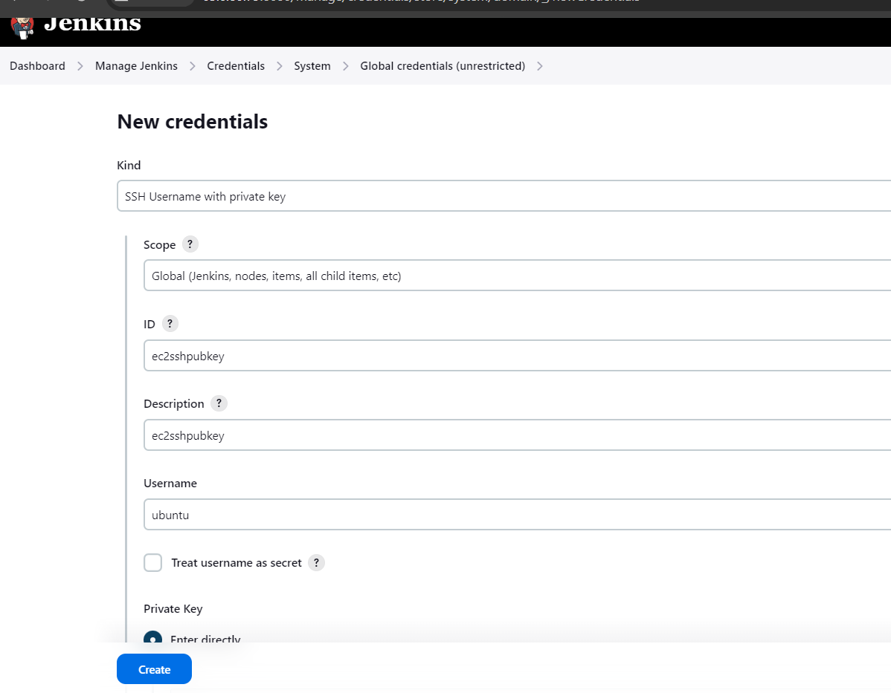
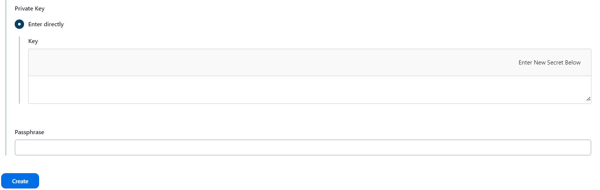

- Now Go to your github account settings-> SSH and GPG keys -> New SSH Key -> Add title and paste the content of ssh public key created earlier on ec2 instance.

- This allows Github to authenticate with EC2 instance when Jenkins Job will run and pull code from Github repository. 

- Create a new entry of kind "SSH Username with private key"
Enter following details -


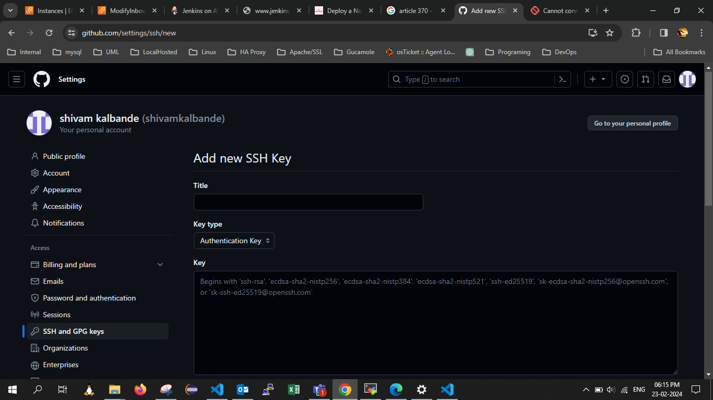

---

###3. Creating Node.js Application:

- Install nodejs and npm  on EC2 instance:

```bash 
sudo apt install nodejs
sudo apt install npm
```
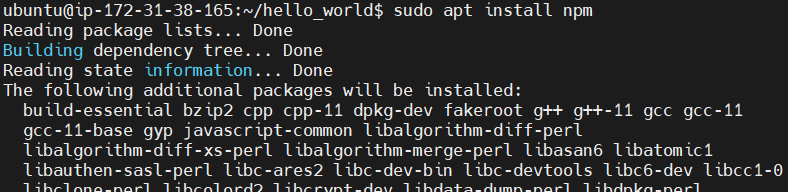

- Creating a simple "Hello, World!" Node.js web application involves below steps:
1.	Initialize the project:

•	 Create a new directory for your project.


•	  Open a terminal or command prompt and navigate to the directory you just created.
•	 Run npm init -y to initialize a new Node.js project with default settings.

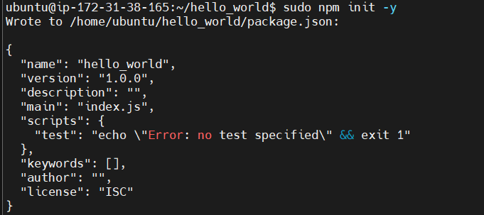

2.	Install Express (optional, but recommended for web applications):
•	Express is a popular web framework for Node.js that simplifies the process of creating web applications.
•	Run npm install express to install Express as a dependency for your project.

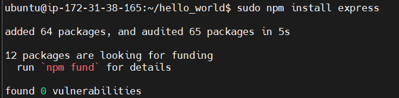

3.	Create the main application file:
•	Create a JavaScript file (e.g., app.js) in your project directory.
•	Open app.js in a text editor.
•	Write the code for your "Hello, World!" web application using Express. Below is a simple example:

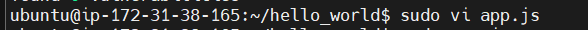

Your project directory should look like this.

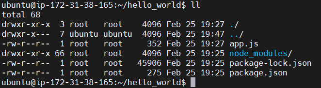

Write your Hello world application as below.

app.js
```javascript
// Import the Express module
const express = require('express');

// Create an Express application
const app = express();

// Define a route handler for the root URL
app.get('/', (req, res) => {
  res.send('Hello, World!');
});

// Start the server and listen on port 8000
app.listen(8000, () => {
  console.log('Server is running on port 8000');
});

```

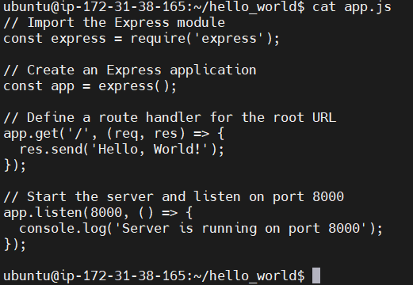

4.	Run the application:
•	In the terminal, navigate to your project directory.
•	Run node app.js to start the Node.js application.
node app.js

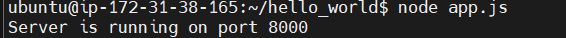

---

###4. Setting up Docker:

- Install docker on Ubuntu ec2 instance  using the following commands:

```bash
sudo apt install docker.io
#to add current user to docker group
sudo usermod -a -G docker $USER
```


- To create a Dockerfile for your "Hello, World!" Node.js web application, you'll follow these steps:
1.	Create a Dockerfile: In your project directory, create a file named Dockerfile.

```bash
sudo vi Dockerfile
```

2.	Open the Dockerfile in a text editor and add the following content:
sudo vi Dockerfile
 
 

DockerfileCopy code

```hcl
# Use the official Node.js image with the LTS version
FROM node:14

# Set the working directory inside the container
WORKDIR /app

# Copy package.json and package-lock.json to the working directory
COPY package*.json ./

# Install dependencies
RUN npm install

# Copy the rest of the application code to the working directory
COPY . .

# Expose port 8000 to the outside world
EXPOSE 8000

# Command to run the application
CMD ["node", "app.js"]
```
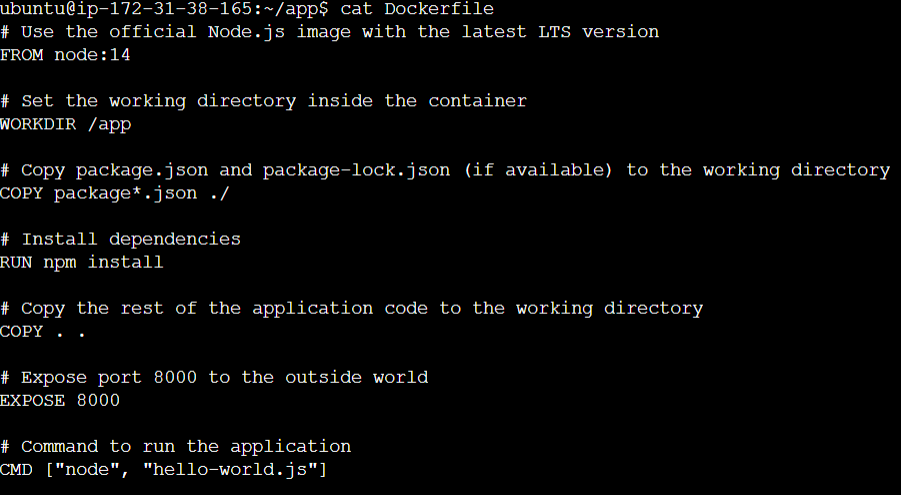

3.	Save the Dockerfile.
This Dockerfile specifies a multi-stage build process:
•	It uses the official Node.js image with the LTS version as the base image.
•	It sets the working directory inside the container to /app.
•	It copies package.json and package-lock.json to the working directory and installs dependencies using npm install.
•	It copies the rest of the application code to the working directory.
•	It exposes port 8000 of the container to the outside world.
•	It specifies the command to run the application (node app.js).


- With this Dockerfile, you can now build a Docker image for your Node.js application by running `docker build .` in the project directory. 

```bash
sudo docker build . -t node-app
```

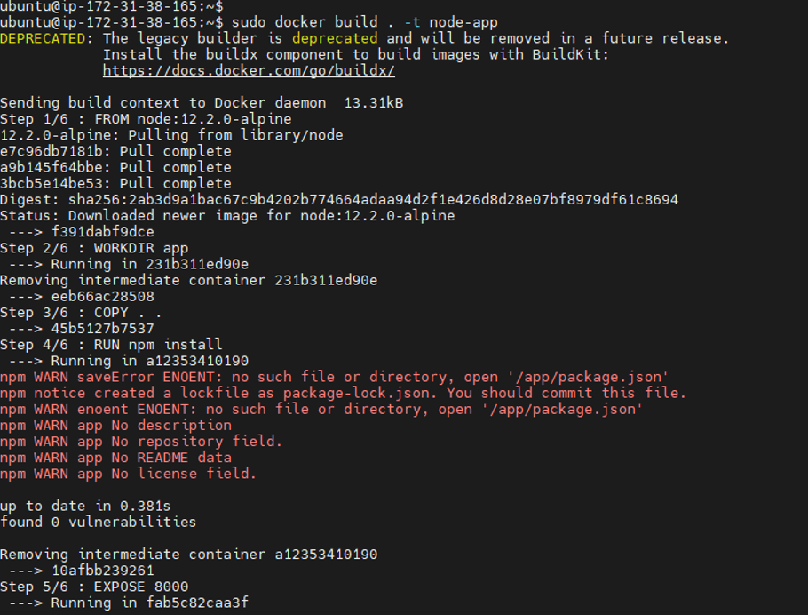
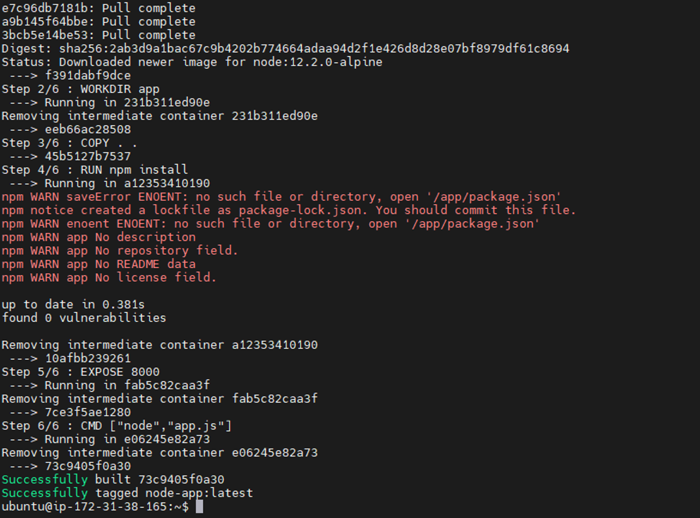

- Docker imaage created can be viewed  using `docker images` command.

```bash
docker images
```
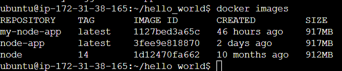


- After the image is built, you can run a container based on the image using 
```bash
docker run -d -p 8000:8000 <image_id>
```
- This will start your Node.js application inside a Docker container, and you'll be able to access it at http://your-aws-ec2-publicip:8000 or check with `curl`.

 ```bash
docker run -d -p 8000:8000 node-app
docker ps
curl http://65.0.80.79:8000
 ```
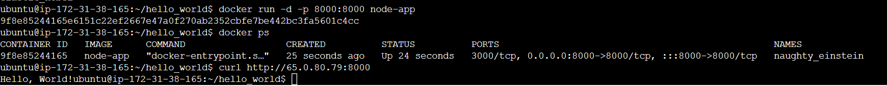


5.	Access the application:
•	Open a web browser and navigate to http://your-ec2public:8000.
•	You should see the message "Hello, World!" displayed in the browser.

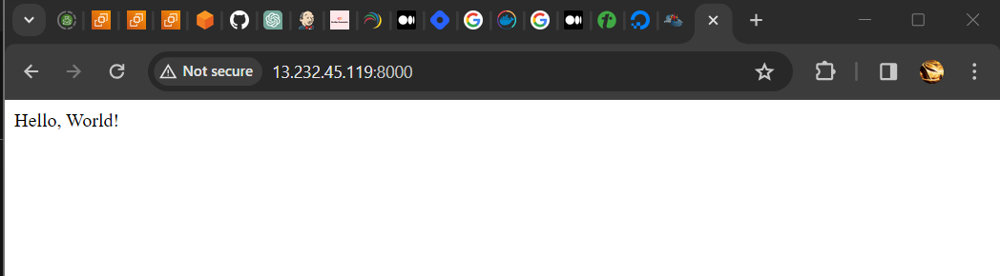

---

###5. Implementing CICD Pipeline:


- Run below command in ec2 terminal so that jenkins user can access docker.

`sudo usermod -aG docker jenkins`

- Go to jenkins for creating Job.

1. Create a freestyle job in jenkins as follow:

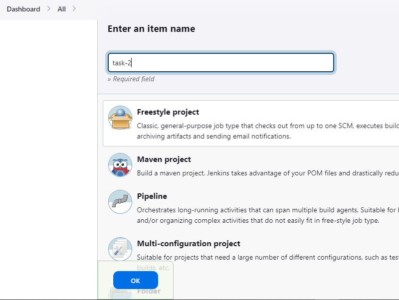

- You can choose to discard  old builds or keep them around (up to your

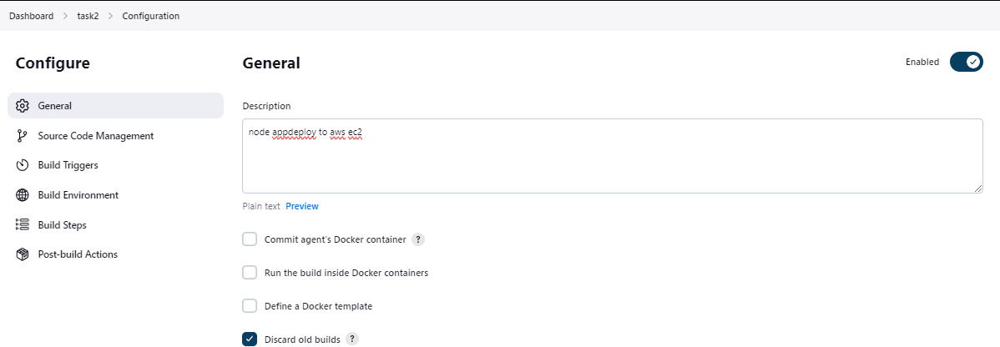

- Also you can specify  how many days you want to keep the build and Max number of builds to keep. 
  
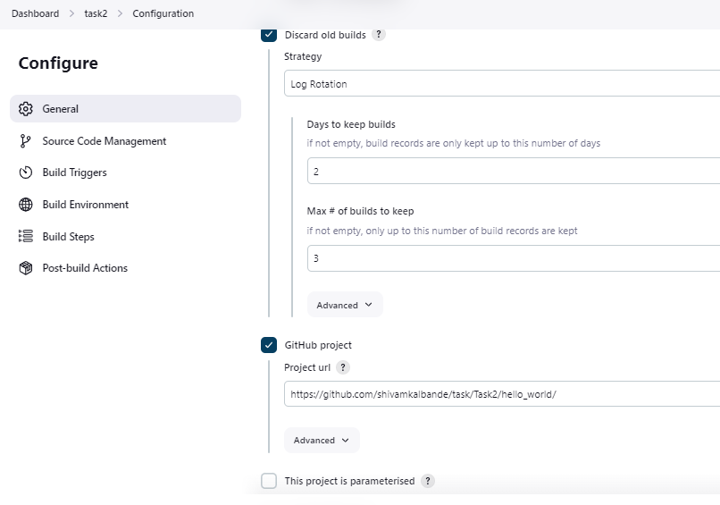

- Add your github project URL. Here you have to add till your projects root folder:

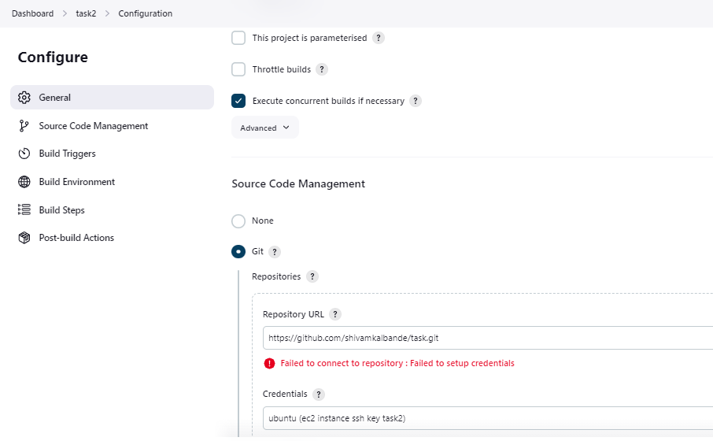

- In Source Code Management  tab select Git and enter your Github repository URL

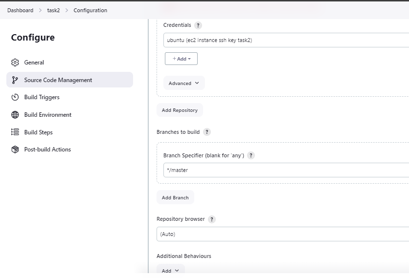

- You have to add credentials - add exixting one if you have already added or create new one to access ec2 instance.
- Here I have added ssh public key.

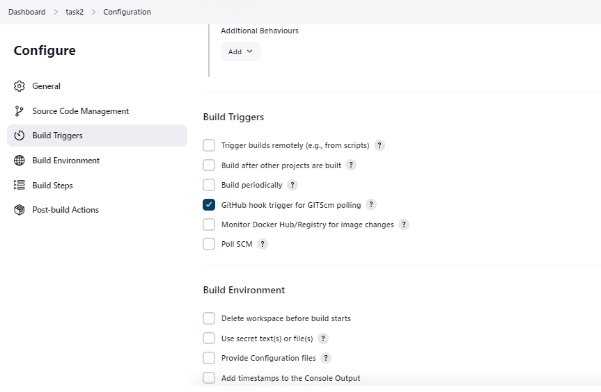


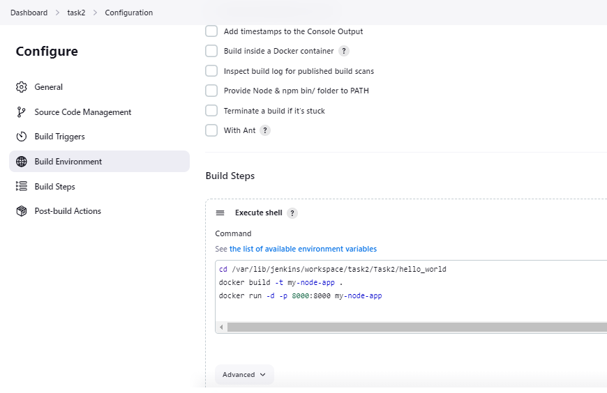


In build  steps add shell script and enter following commands :
```bash
cd /var/lib/jenkins/workspace/task2/Task2/hello_world
docker build -t my-node-app .
docker run -d -p 8000:8000 my-node-app
```

- `cd` command to direct to project folder.
- command to perform docker build 
- command to run the container


Finally apply the configuration and save it. After that you have to Build the jenkins job.

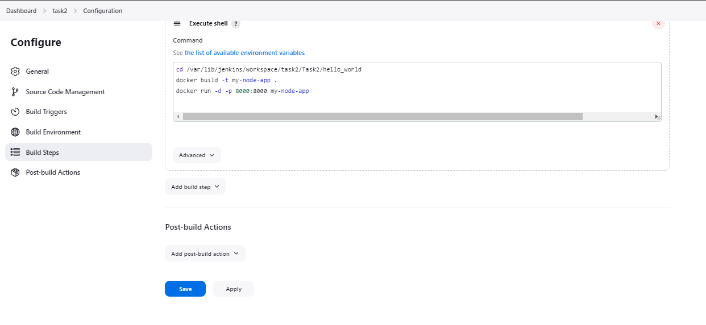

After build  is completed, You will get a green signal on and console will give `Finished : SUCCESS` output at last. 

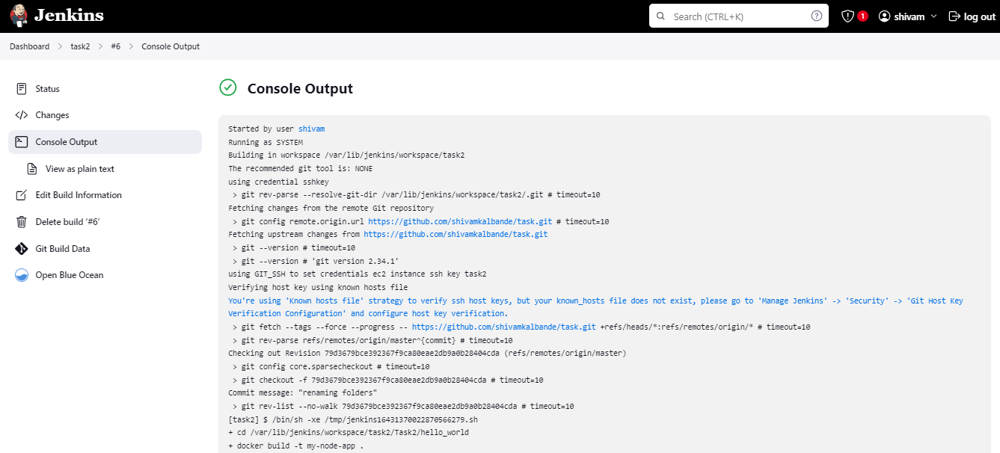


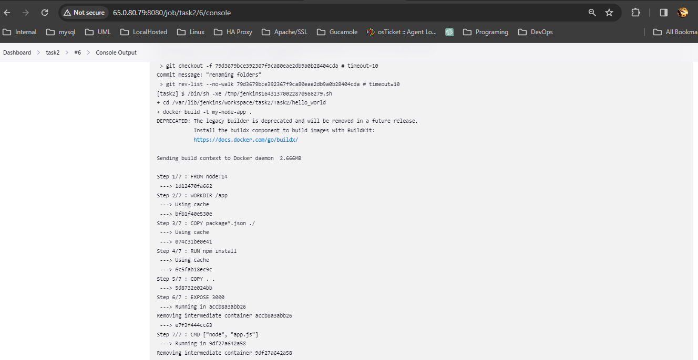


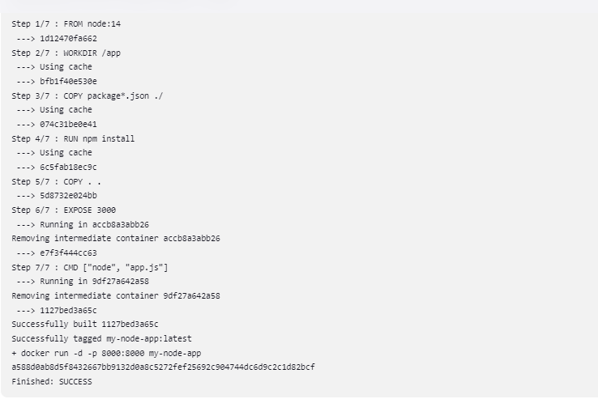


- In browser you can check the url of your app:


---