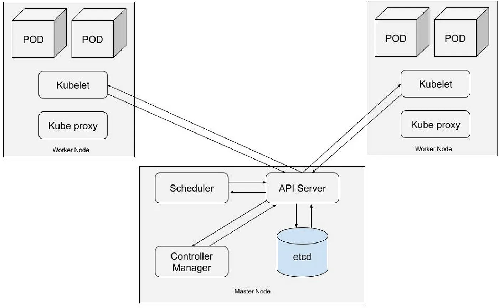
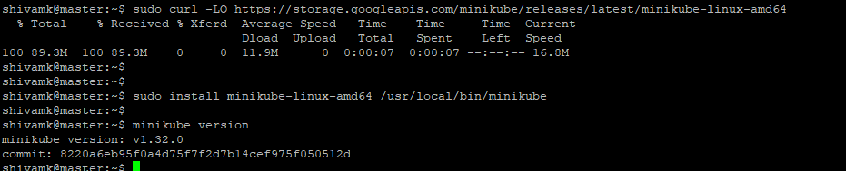
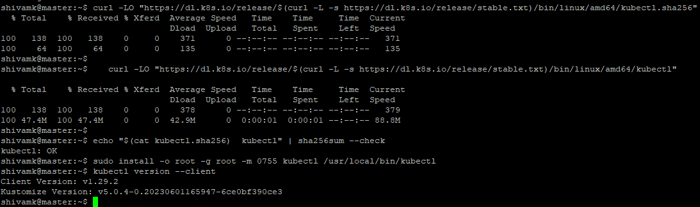
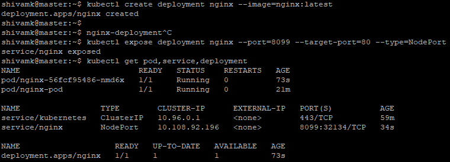
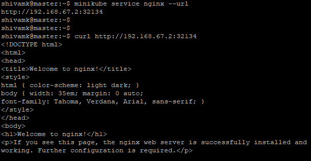

#3.Minikube, Kubernetes

##Task Overview
- Understand Minikube
- Install Minikube either on your local laptop or on AWS EC2 instance
- Run Nginx named POD on Minikube with container image "nginx:latest" and expose Nginx application on port 80


##Prerequisites
- Pre-Install Ubuntu 22.04 system
- 2 GB RAM or more
- 2 CPU or more
- 20 GB free disk space
- Sudo used with admin access
- Reliable Internet Connectivity
- Docker Installed
  
Refrence URL


>https://minikube.sigs.k8s.io/docs/start/
https://www.linuxbuzz.com/install-minikube-on-ubuntu/

---

#1.Understanding Minikube
Minikube is a tool that allows you to run Kubernetes locally by running the latest version of Kubernetes in a VM on your machine. 




### Master Node:

- The master node is responsible for managing the Kubernetes cluster.
- It runs essential Kubernetes components such as the **API server, controller manager, scheduler, and etcd.**
- The **API server** is the central management entity that receives and processes requests from users, nodes, and other cluster components.
- The **controller manager** manages various controllers responsible for maintaining the desired state of the cluster, such as the ReplicaSet, Deployment, and Service controllers.
- The **scheduler** is responsible for scheduling pods onto nodes based on resource requirements and other constraints.
- **etcd** is a distributed key-value store that stores cluster state and configuration data.
- In Minikube, all of these components run within a single virtual machine, making up the master node.

### Worker Node:

- The worker node components (Pod, Kubelet, and Kube-proxy) work together to manage and run containerized workloads efficiently on each node in the Kubernetes cluster. Pods encapsulate application containers, Kubelet manages Pod lifecycle, and Kube-proxy ensures networking connectivity between Pods and services within the cluster.

- A **Pod** is the smallest deployable unit in Kubernetes.
- It represents a single instance of a running process in your cluster.
- Pods can contain one or more containers that share networking and storage resources and are scheduled together.
- Each Pod is assigned a unique IP address within the cluster, and all containers in the Pod share the same IP address.

- **Kubelet** is an agent that runs on each node in the cluster and is responsible for managing the Pods.
- It ensures that containers are running and healthy by communicating with the Kubernetes API server.
- Kubelet listens for Pod specifications via the Kubernetes API and ensures that the specified containers are running within the Pod.
- It also monitors the health of the containers and restarts them if they fail or crash.

- **Kube-proxy** is a network proxy that runs on each node in the cluster.
- It maintains network rules (such as routing, load balancing, and service discovery) to enable communication between Pods and services within the cluster.
- Kube-proxy implements the Kubernetes Service concept, which provides a consistent networking interface to Pods regardless of their underlying infrastructure.
- It also handles the forwarding of traffic to the correct destination Pod based on the service configuration.


In summary, the **master node** in Minikube manages the control plane components and cluster state, while the **worker nodes** host the application workloads in the form of pods. Together, they form a Kubernetes cluster that orchestrates containerized applications.


#2.Installing Minikube and kubectl in Ubuntu 

To install the latest minikube stable release on x86-64 Linux using binary download:

```bash
#download minikube binary
curl -LO https://storage.googleapis.com/minikube/releases/latest/minikube-linux-amd64
#install minikube
sudo install minikube-linux-amd64 /usr/local/bin/minikube
#check version
minikube version
``` 




To install  kubectl, use the following commands:

```bash
#download binary
curl -LO "https://dl.k8s.io/release/$(curl -L -s https://dl.k8s.io/release/stable.txt)/bin/linux/amd64/kubectl"
#download checksum
curl -LO "https://dl.k8s.io/release/$(curl -L -s https://dl.k8s.io/release/stable.txt)/bin/linux/amd64/kubectl.sha256"
#compare checksum
echo "$(cat kubectl.sha256)  kubectl" | sha256sum --check
#install kubectl
sudo install -o root -g root -m 0755 kubectl /usr/local/bin/kubectl
#check version
kubectl version --client
```


- You can create a sample deployment for Nginx and expose it on port 8099 using kubectl commands directly. Below are the steps:

#3. **Create Deployment:**

```bash
kubectl create deployment nginx --image=nginx:latest
```
This command creates a Deployment named "nginx" with one replica using the Nginx image.


#4.Expose Deployment:

```bash
kubectl expose deployment nginx --port=8099 --target-port=80 --type=NodePort
```
This command exposes the Deployment "nginx" on port 8099 using a NodePort service type. It maps port 8099 of the service to port 80 of the pods in the deployment.

```bash
kubectl get pod,service,deployment
or
kubectl get deployments
kubectl get pods
kubectl get services
```



Optional: Get Service URL:

```bash
minikube service nginx --url
curl http://<your-pod-cluster-ip>:port
```
If you're using Minikube, this command will give you the URL to access the Nginx deployment via the exposed NodePort service. Make sure Minikube is running and has the appropriate addon enabled (e.g., minikube tunnel for accessing NodePort services from outside the cluster).
 
 

---
