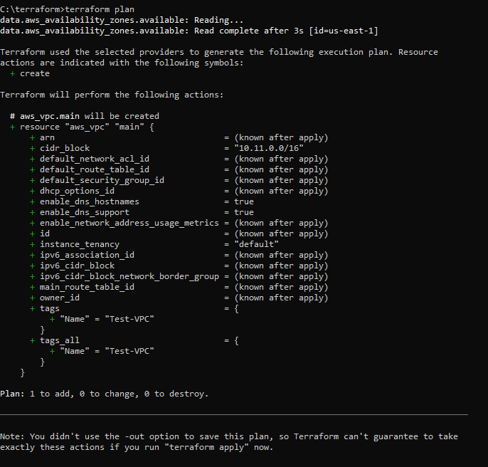
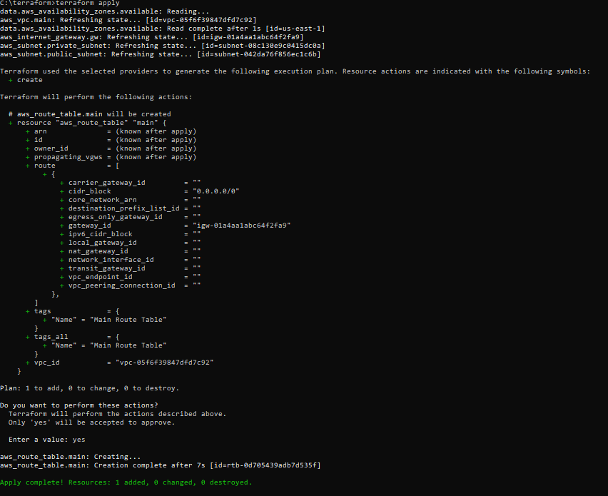
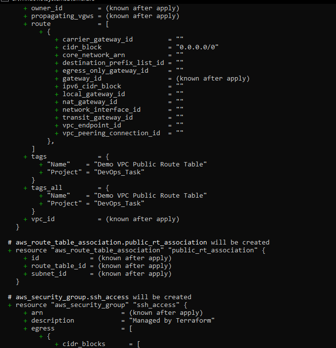

##Task 4: Terraform, AWS, Sample App
Important Note: Do not push your AWS Access key and Secret key to GitHub 
repository

##Task Overview

1.  Install Terraform on your local laptop
2.  Create Access keys in your AWS account
3.  Install AWS CLI on your local laptop
4.  Configure AWS on your local laptop using Access key and Secret key
5.  Create Terraform script to create infrastructure on AWS
  
 ---

##1.  **Installing Terraform**
  - Download the latest version of Terraform from the official website (https://www.terraform.io/downloads.html)
    
- Go to below link and download the .exe file on windows machine. 
OR 

```
https://releases.hashicorp.com/terraform/1.7.3/terraform_1.7.3_windows_386.zip
```

- Unzip the file in  C:\terraform folder (or any other location you prefer) 

- Open command prompt  and navigate to that directory using cd command. 

- Check the version of terraform using below command: 

`terraform --version`


##2. **Setup AWS Account & Generate Access Keys**

- Now, login to your aws account login and search for IAM service.
- Crete a new User with programmatic access. Give it necessary permissions like EC2 full access etc.
- Take note of Access Key ID and Secret Access Key. DON'T SHARE THIS WITH ANYONE!

- Download the keypair and save it  somewhere safe. You will need this information for configuring AWS CLI later.


access key:xxxxxxxxxxxx
secret key:xxxxxxxxxxxxxxxxxxxxxxxxxxxxxx

##3. **Install AWS CLI on your local laptop**

- Go to this link and download  the latest version for Windows :

```
 https://awscli.amazonaws.com/AWSCLIV2.msi
```

- Install the awscli on laptop from downloaded setup.

- Open Command Prompt and run following command to configure aws cli :


Below are refrence urls  used while configuring aws cli :
```
https://docs.aws.amazon.com/cli/latest/userguide/getting-started-install.html
https://developer.hashicorp.com/terraform/tutorials/aws-get-started/install-cli
```

##4. **Configure AWS on your local laptop using Access key and Secret key**
  
`aws configure`


Create terraform file main.tf with content as shown below with notepad or any text editor tool:

`notepad main.tf`

```
provider "aws" {
	access_key ="<your_access_key>"
	secret_key="<your_secret_key>"
	region = "us-east-1a"
}
```
Initilize the terraform  by running following commands in cmd : 

`terraform init`


##5. **Create terraform script to create below infrastructure on AWS**

###VPC
--https://computingforgeeks.com/how-to-install-terraform-on-ubuntu/
--Terraform Hands-on Project — Build Your Own AWS Infrastructure with Ease using Infrastructure as Code | by Sayali Shewale | Medium
--How to Build AWS VPC & Subnets using Terraform - Step by Step (spacelift.io)
--https://registry.terraform.io/providers/hashicorp/aws/latest/docs/resources/vpc


```
provider "aws" {
	access_key =" "
	secret_key=" "
	region = "us-east-1"
}

##Retrive the AZ where we want to create network resources
data "aws_availability_zones" "available" {}
#VPC Resources
resource "aws_vpc" "main" {
  cidr_block = "10.11.0.0/16"
  enable_dns_support = true
  enable_dns_hostnames = true
  tags = {
    Name = "Test-VPC"
  } 
}
```
> terraform plan
> terraform validate
> terraform apply
	--YES to apply

You can also save the plan and then apply to save your plan and then apply  it later if needed.
> terraform show
> terraform plan -out=tfplan



###	Internet Gateway

```
provider "aws" {
	access_key =" "
	secret_key=" "
	region = "us-east-1"
} 
##Retrive the AZ where we want to create network resources
data "aws_availability_zones" "available" {}
#VPC Resources
resource "aws_vpc" "main" {
  cidr_block = "10.11.0.0/16"
  enable_dns_support = true
  enable_dns_hostnames = true
  tags = {
    Name = "Test-VPC"
  } 
}

resource "aws_subnet" "public_subnet" {
  vpc_id     = aws_vpc.main.id
  cidr_block = "10.11.1.0/24"
  tags = {
    Name = "Public Subnet"
  }
}

resource "aws_subnet" "private_subnet" {
  vpc_id     = aws_vpc.main.id
  cidr_block = "10.11.2.0/24"
  map_public_ip_on_launch = false 
  tags = {
    Name = "Private Subnet"
  }
}

resource "aws_internet_gateway" "gw" {
  vpc_id = aws_vpc.main.id
  
  tags = {
    Name = "Internet Gateway"
  }
}
```


###	Public Subnet

```
provider "aws" {
	access_key =" "
	secret_key=" "
	region = "us-east-1"
}
##Retrive the AZ where we want to create network resources
data "aws_availability_zones" "available" {}
#VPC Resources
resource "aws_vpc" "main" {
  cidr_block = "10.11.0.0/16"
  enable_dns_support = true
  enable_dns_hostnames = true
  tags = {
    Name = "Test-VPC"
  } 
}
resource "aws_subnet" "public_subnet" {
  vpc_id     = aws_vpc.main.id
  cidr_block = "10.11.1.0/24"

  tags = {
    Name = "Public Subnet"
  }
}
```

> terraform plan
> terraform validate
> terraform apply
--YES to apply


###	Private Subnet

```
provider "aws" {
	access_key =" "
	secret_key=" "
	region = "us-east-1"
}
##Retrive the AZ where we want to create network resources
data "aws_availability_zones" "available" {}
#VPC Resources
resource "aws_vpc" "main" {
  cidr_block = "10.11.0.0/16"
  enable_dns_support = true
  enable_dns_hostnames = true
  tags = {
    Name = "Test-VPC"
  } 
}
resource "aws_subnet" "public_subnet" {
  vpc_id     = aws_vpc.main.id
  cidr_block = "10.11.1.0/24"

  tags = {
    Name = "Public Subnet"
  }
}
resource "aws_subnet" "private_subnet" {
  vpc_id     = aws_vpc.main.id
  cidr_block = "10.11.2.0/24"

  tags = {
    Name = "Private Subnet"
  }
}
```

> terraform plan
> terraform validate
> terraform apply
	--YES to apply


###	Route Table, Internet Gateway

```
provider "aws" {
	access_key =" "
	secret_key=" "
	region = "us-east-1"
}
##Retrive the AZ where we want to create network resources
data "aws_availability_zones" "available" {}
#VPC Resources
resource "aws_vpc" "main" {
  cidr_block = "10.11.0.0/16"
  enable_dns_support = true
  enable_dns_hostnames = true
  tags = {
    Name = "Test-VPC"
  } 
}

resource "aws_subnet" "public_subnet" {
  vpc_id     = aws_vpc.main.id
  cidr_block = "10.11.1.0/24"
  tags = {
    Name = "Public Subnet"
  }
}

resource "aws_subnet" "private_subnet" {
  vpc_id     = aws_vpc.main.id
  cidr_block = "10.11.2.0/24"
  map_public_ip_on_launch = false 
  tags = {
    Name = "Private Subnet"
  }
}

resource "aws_internet_gateway" "gw" {
  vpc_id = aws_vpc.main.id
  
  tags = {
    Name = "Internet Gateway"
  }
}

resource "aws_route_table" "main" {
  vpc_id = aws_vpc.main.id
  route {
    cidr_block = "0.0.0.0/0"
    gateway_id = aws_internet_gateway.gw.id
  }
  tags = {
    Name = "Main Route Table"
  }
}
```



###	Route Table Association with Subnets


###	EC2 Instance
###	Security Group


###	Elastic IP

```hcl
provider "aws" {
	access_key ="**************"
	secret_key ="**********************"
	region     = "ap-south-1"
}

##Retrive the AZ where we want to create network resources
data "aws_availability_zones" "available" {}
#VPC Resources
resource "aws_vpc" "main" {
  cidr_block 	       = "10.11.0.0/16"
  enable_dns_support   = true
  enable_dns_hostnames = true
  tags = {
    Name = "Test-VPC"
    Project = "DevOps_Task"
  } 
}

resource "aws_subnet" "private_subnet" {
  vpc_id     = aws_vpc.main.id
  cidr_block = "10.11.2.0/24"
  map_public_ip_on_launch = false 
  tags = {
    Name = "Private Subnet"
    Project = "DevOps_Task"
  }
}


resource "aws_subnet" "public_subnet" {
  vpc_id     = aws_vpc.main.id
  cidr_block = "10.11.1.0/24"
  map_public_ip_on_launch = true
  tags = {
    Name = "Public Subnet"
    Project = "DevOps_Task"
  }
}


resource "aws_internet_gateway" "gw" {
  vpc_id = aws_vpc.main.id
  
  tags = {
    Name = "Internet Gateway"
    Project = "DevOps_Task"
  }
}

resource "aws_route_table" "public_rt" {
  vpc_id = aws_vpc.main.id
  route {
    cidr_block = "0.0.0.0/0"
    gateway_id = aws_internet_gateway.gw.id
  }
  tags = {
    Name = "Demo VPC Public Route Table"
    Project = "DevOps_Task"
  }
}

resource "aws_route_table_association" "public_rt_association" {
  subnet_id      = aws_subnet.public_subnet.id
  route_table_id = aws_route_table.public_rt.id
}

resource "aws_instance" "EC2_web_server" {
  ami                    = "ami-03f4878755434977f"       # Specify your AMI ID
  instance_type          = "t2.micro"
  subnet_id              = aws_subnet.public_subnet.id
  key_name               = "terraform_key" # Specify your key pair name
  vpc_security_group_ids = [
	aws_security_group.ssh_access.id
]
  user_data = <<-EOF
        #!/bin/bash
        sudo apt-get update -y
        sudo apt-get install apache2 -y
        sudo systemctl start apache2
        sudo systemctl enable apache2
        echo "<html><body><h1>Welcome to my website! Hello from your EC2 instance!</h1></body></html>" > /var/www/html/index.html
        sudo systemctl restart apache2
  EOF

  tags = {
    Name = "User-Data-Script-for-EC2"
    Project = "DevOps_Task"
  }
}

resource "aws_security_group" "ssh_access" {
  name_prefix = "ssh_access"
  vpc_id      =  aws_vpc.main.id
  ingress {
    from_port   = 22
    to_port     = 22
    protocol    = "tcp"
    cidr_blocks = ["0.0.0.0/0"]
  }
  ingress {
    from_port   = 80
    to_port     = 80
    protocol    = "tcp"
    cidr_blocks = ["0.0.0.0/0"]
  }
  egress{
    from_port   = 0
    to_port     = 0
    protocol    = "-1"
    cidr_blocks = ["0.0.0.0/0"]
 }
 tags = {
    Name = "demo-ssh-security-group"
    Project = "DevOps_Task"
  }
}

#resource "aws_eip" "eip" {
#  instance = aws_instance.web_server.id
  
#  tags = {
#    Name = "My-Ec2-test-eip"
#  }
#}

resource "aws_eip" "example" {
  instance = aws_instance.EC2_web_server.id
}

resource "aws_eip_association" "eip_assoc" {
  instance_id   = aws_instance.EC2_web_server.id
  allocation_id = aws_eip.example.id
}
```





You need to pass User-data script to EC2 Instance resource group 
Section in terraform to install and run sample application using terraform

Now go to your AWS console and search for VPC service.
Check for the services/resources are created as per script or not.


Search fro your Elastic IP in browser.

- Refer this blog for this task, also read my comment below this blog.
``` 
https://medium.com/@sayalishewale12/terraform-hands-on-projectbuild-your-own-aws-infrastructure-with-ease-using-infrastructure-as9f17640518
```
### DESTROYING the Resources

To destroy all resources created by this Terraform configuration:

`terraform destroy`

You will be asked for conformation  before proceeding with the destruction of these resources. Type `yes` when prompted to confirm each.

`Enter value = yes`

This will delete the AWS VPC, subnets, security groups, EC2 instances, EIP addresses, Internet Gateways, and Routing Tables.


After this you can verify in aws console that your resources are destroyed.

------------------------------------------


